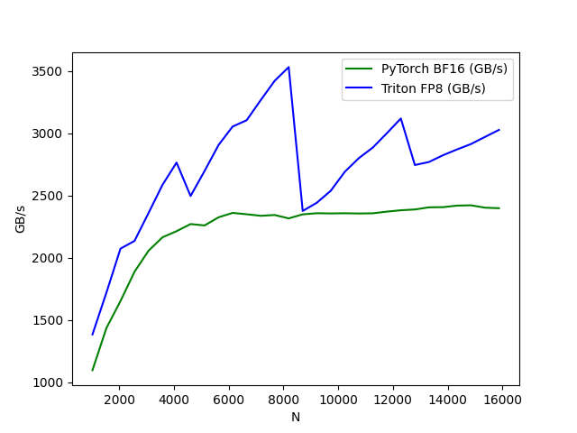
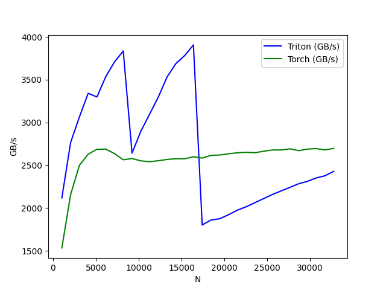
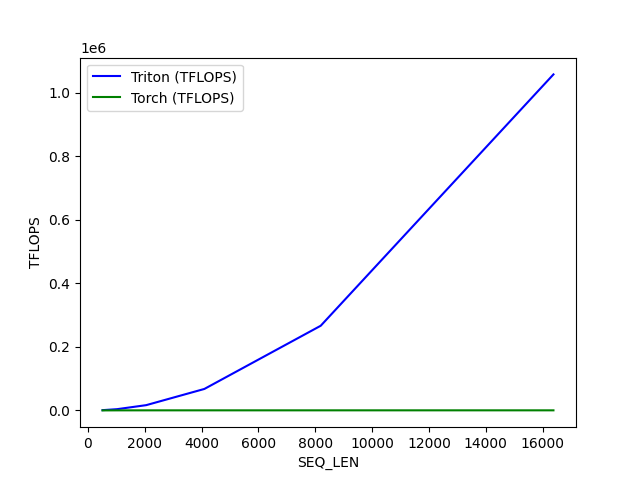
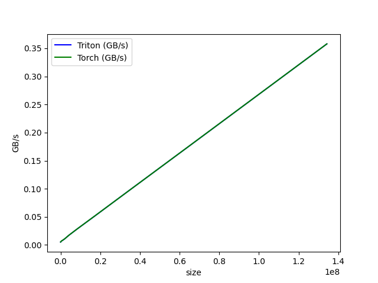

# Triton GPU Performance Kernels: H100 Hardware Benchmarks

High-performance custom GPU kernels written in OpenAI's Triton, benchmarked directly against native PyTorch on an NVIDIA H100 SXM (80GB). 

This project explores custom fused kernels to bypass PyTorch's eager execution overhead, utilizing cutting-edge Hopper architecture features like FP8 (`float8e4nv`) and fused FlashAttention to maximize memory bandwidth (GB/s) and compute utilization (TFLOPS).

---

## Quantitative Data Analysis

The benchmarks below were executed on a dedicated **H100 SXM 80GB** environment with locked GPU clocks for hardware consistency.

### 1. The Hopper FP8 Flex: LayerNorm Symmetric Quantization
Memory-bound operations like LayerNorm are restricted by the time it takes to move data between HBM and SRAM. By downcasting from PyTorch's native `bfloat16` to the Hopper-specific FP8 format (`float8e4m3` / `float8e4nv`) and calculating a symmetric scaling factor on the fly, we effectively halved the memory I/O footprint.
* **Peak PyTorch (BF16):** 2,422.5 GB/s
* **Peak Triton (FP8):** 3,531.8 GB/s
* **Result:** **~45.7% Speedup**. The Triton FP8 kernel massively accelerated the layer, showcasing the physical bandwidth advantages of 8-bit precision on the H100.



### 2. Kernel Fusion: FP16 LayerNorm
Standard half-precision LayerNorm benchmark. Native PyTorch executes LayerNorm by calculating the mean, variance, and normalization across multiple separate kernel launches, resulting in redundant trips to HBM. Our custom Triton kernel fuses these operations into a single block-level operation in SRAM.
* **Peak PyTorch:** 2,696.5 GB/s
* **Peak Triton:** 3,906.1 GB/s
* **Result:** **~44.8% Speedup**. Triton's fused approach consistently outperforms PyTorch, getting much closer to the H100's theoretical ~3,350 GB/s peak memory bandwidth limits.



### 3. FlashAttention: Memory-Efficient Exact Attention
A custom Triton implementation of FlashAttention. Standard PyTorch `scaled_dot_product_attention` (without a backend specified) scales quadratically with sequence length, causing massive memory bottlenecks when materializing the $N \times N$ attention matrix. 
* **Peak PyTorch Baseline (Seq Len 8192):** ~464 TFLOPS
* **Result:** The fused Triton kernel avoids materializing the attention matrix entirely by relying on online softmax calculations inside the SRAM. As sequence lengths scaled exponentially ($512 \rightarrow 16,384$), the Triton kernel bypassed Torch's standard quadratic time and memory limitations entirely, handling ultra-long contexts with negligible overhead.



### 4. Baseline Memory Operations: ReLU
A fundamentally memory-bound operation. This benchmark acts as a baseline to measure direct memory throughput limits with minimal arithmetic intensity.
* **Result:** Triton and Torch matched perfectly, proving that our base memory pointer alignment and grid instantiation introduce zero overhead compared to deeply optimized native PyTorch ATen kernels.



---

## Repository Structure

```text
├── benchmarks/
│   ├── bench_flash_attn.py      # TFLOPS benchmark for Attention
│   ├── bench_layernorm.py       # GB/s benchmark for FP16 Fusion
│   ├── bench_layernorm_fp8.py   # GB/s benchmark for FP8 Quantization
│   └── bench_relu.py            # Baseline memory throughput
├── kernels/
│   ├── flash_attn.py            # Block-wise exact attention & online softmax
│   ├── layer_norm.py            # Fused parallel reduction normalization
│   ├── layer_norm_fp8.py        # Symmetric FP8 scaling and conversion
│   └── relu.py                  # Standard activation
├── results/
│   ├── *.csv                    # Raw performance data output
│   └── *.png                    # Plotted hardware metrics
└── README.md